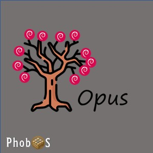
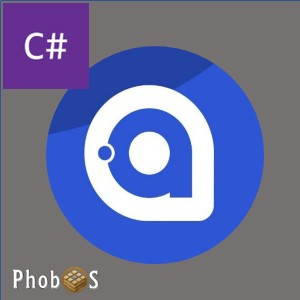
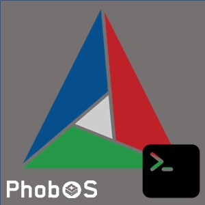

# VS Code PhobOS Templates

> [!WARNING]
> This is an experimental project to bring support for PhobOS to the VS Code Torizon IDE Extension.

This repository maintains the templates used in conjunction with the [VS Code Torizon Integrated Development Environment Extension](https://developer.toradex.com/torizon/application-development/ide-extension/). Focusing in the VS Code for automation between the development environment for remote debug, remote deploy of containerized applications for Toradex TorizonCore easy-to-use Industrial Linux Software Platform.

## Templates

| TEMPLATE                                                              | DESCRIPTION                                         | RUNTIME | LANGUAGE | ARCH                                                                                        | FOLDER                                                   | CONTRIBUTOR                                                                                                    |
| --------------------------------------------------------------------- | --------------------------------------------------- | ------- | -------- | ------------------------------------------------------------------------------------------- | -------------------------------------------------------- | -------------------------------------------------------------------------------------------------------------- |
|          | Opus Generic project                                | OSTree  | YAML     |   | [genericOpus](./genericOpus)                             | [@microhobby](https://www.github.com/microhobby)  |
|                    | Avalonia UI Framework using fbdev or DRM as backend | .NET 10 | C#       |   | [dotnetAvaloniaFrameBuffer](./dotnetAvaloniaFrameBuffer) |  [@microhobby](https://www.github.com/microhobby) |
|  | cmake console                                       | libc++  | C++      |   | [cmakeConsole](./cmakeConsole)                           |  [@microhobby](https://www.github.com/microhobby) |
